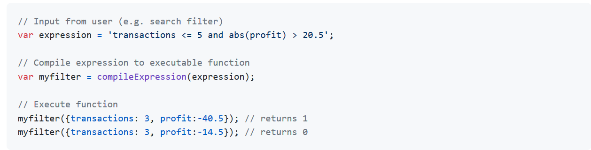
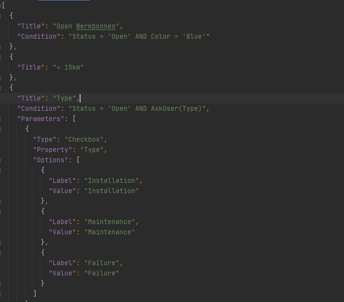
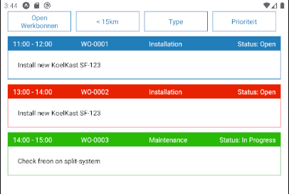
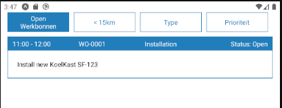
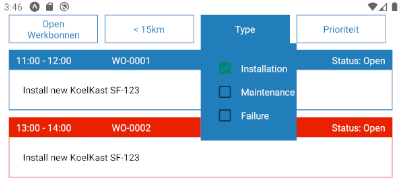

## FieldBuddy Filters Case Demo
#### Monika Nawój

---

## Technology

* expo
* Typescript
* React Native
* Moment.js
* filtrex.js

NOTE: Expo - for building the app, as you requested
Typescript - I just like to have types, I'm working with typescript so I decided to use it
React Native - It's my first time even using it, so before the task I needed to quickly learn it
Moment.js - for simply parsing the date in orders
filtrex.js - for compiling expressions in my filters
---
## Filtrex

NOTE:
Filtrex is a library that can compile expressions and allows user to define their own,
so I decided to use this feature for askUser functions in my filters
---
## Filters structure

NOTE: 
So as you can see every filter has a Title that will be shown to user.
We can specify a condition - all of them are from the examples that you provided me in the task description.
More complicated filters have parameters that will be passed to askUser function.
Parameter has a type - for now we only have a checkbox type.
A property that will be filtered.
And options to show with label and value.

---
## How it looks like

NOTE:
Okay so this is the base view of the app.
We have all of the filters and 3 basic orders.

---
## How it looks like

NOTE:
So this is working examples of the filters.
the simple one and one with parameters to pass.
And basically this is the whole funcionality

---
### What would I do differently?
* Less time on crash courses
* More focus on mobile version
* Unit tests

NOTE:
If I could go back in time and do this assigment one more time.
I would spend way less time on crash courses and start doing the assigment earlier.
I would focus more on mobile version, because I was mostly testing the app on web version
and not everything was working the same on mobile and the web.
And if I had enough time I would add unit tests to make sure that everyting is working as designed.

---
### Any Questions?

